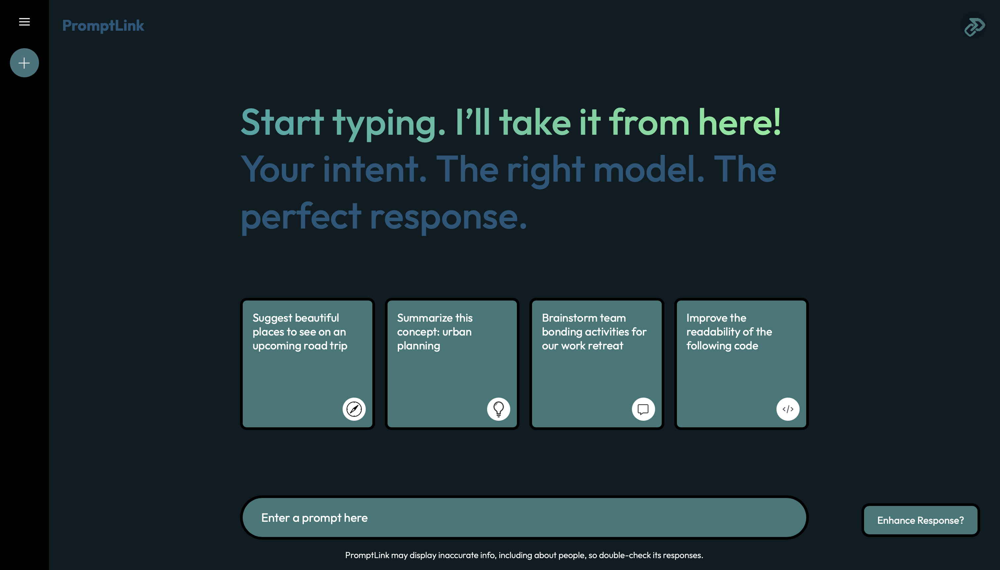
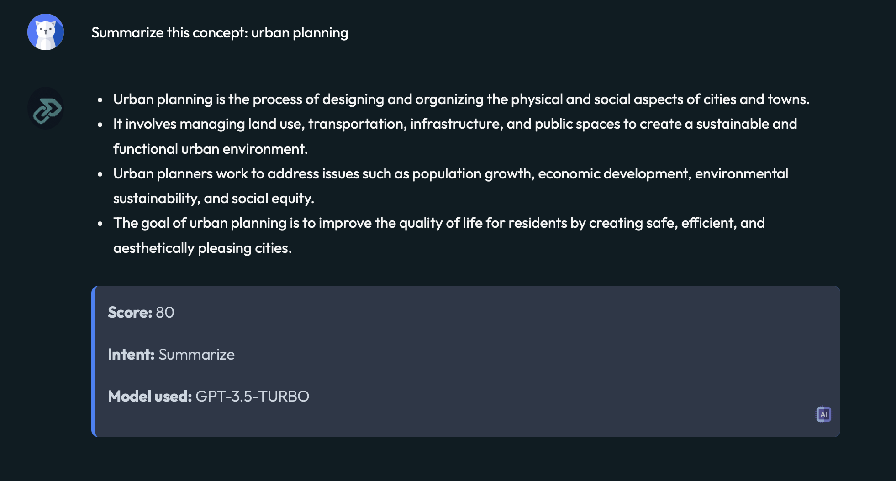

# PromptLink

# PromptLink

**PromptLink** is a full-stack AI prompt-routing system that intelligently detects user intent and dynamically selects the most suitable large language model (LLM) to handle the task. Built with React, FastAPI, LangChain, and Neo4j, the app supports user authentication via Firebase and offers a smooth, chat-like interface that delivers model responses with syntax highlighting, Markdown formatting, and contextual explanations. PromptLink uses an evaluation framework to assess the quality of each response through scoring metrics like similarity and length, enabling automatic enhancements when needed. It also features asynchronous backend handling and context-aware caching to improve performance, reducing latency and boosting efficiency. All interactions are logged in a graph database to visualize reasoning chains and model behavior, helping users trace the AI’s decision-making process.

Check out the YouTube Walkthrough: [PromptLink](https://youtu.be/iLKj3VljcF8).

---

## Table of Contents

1. [Creators](#creators)
2. [Summary](#summary)
3. [Features](#features)
4. [Technology](#technology)
5. [Feedback](#feedback)

---
## Creators

- [Yaseen Sadat](https://github.com/YaseenSadat)
- [Umair Arham](https://github.com/umairx25)

---

## Summary

🌟 **What PromptLink Does**  
PromptLink is an intelligent AI workflow engine that dynamically routes user prompts to the most effective large language model based on intent, quality, and historical context. With built-in scoring, enhancement, and caching systems, it ensures every response is not only fast — but meaningfully accurate. Designed with a focus on clarity, performance, and traceability, PromptLink gives users an interactive chat experience backed by explainable AI, real-time feedback, and powerful backend logic. Whether summarizing text, generating code, or analyzing ideas, PromptLink delivers tailored results with precision and insight.

---

## Features

PromptLink is packed with advanced features designed to deliver fast, accurate, and explainable AI responses. Here’s what makes PromptLink stand out:

### 🔐 User Authentication
Manage secure access to the platform with seamless Firebase-based authentication:

- **Log In, Sign Up, and Log Out**: Secure email/password login system with persistent session handling via Firebase Auth.
- **Error Handling**: User-friendly error messages for incorrect credentials, existing accounts, and weak passwords.
- **Session Persistence**: Auth state is synced on load to preserve login across page refreshes.

### 🧠 Intent Detection & Prompt Routing
PromptLink intelligently determines the purpose of a user’s input and routes it to the right LLM:

- **LangChain-Powered Intent Classification**: Dynamically identifies intent (e.g., summarize, analyze, code).
- **Custom System Prompts**: Injects predefined system instructions based on detected intent.
- **Model Selection Logic**: Automatically routes to the most suitable model (e.g., GPT-4o for code, Gemini for analysis).
- **Explanation Popovers**: On-hover explanations show which model was used and why.

### 📊 Response Scoring System
Evaluate every response with a custom scoring engine to ensure quality:

- **Length and Sentence Fluency**: Penalizes short or poorly structured replies.
- **Keyword Overlap**: Compares key terms in prompt and response.
- **Semantic Scoring (Cosine Similarity)**: Embeds both prompt and response, measuring their conceptual alignment.
- **Chain-of-Thought Validation**: Rewards responses with logical step-by-step reasoning for analytical tasks.

### ✨ Response Enhancement
When a response doesn't meet quality thresholds, PromptLink enhances it automatically:

- **Enhance Button**: Trigger regeneration using refined system instructions.
- **Threshold-Based Triggers**: Enhancements auto-activate for low-scoring responses.
- **UI Feedback**: Clearly marks enhanced responses with new model, score, and highlights.

### ⚡ Performance & Caching
Reduce latency and cost while maintaining speed and consistency:

- **Asynchronous Backend (FastAPI)**: Handles all logic concurrently for rapid response times.
- **Context-Aware Caching**: Reuses responses for repeated prompts, reducing redundant model calls.
- **Cache Indicator**: Clearly shows when a response was served from cache.

### 🖼️ Frontend Experience (React + Vite)
A rich, modern user interface with fully responsive and interactive design:

- **Chat UI with Markdown & Code Highlighting**: Displays responses with syntax-aware formatting.
- **Card-Based Prompt Suggestions**: Kickstart interaction with smart examples.
- **Sidebar Prompt History**: Recalls past conversations, organized into expandable folders.
- **Live Enhancements & Loading Indicators**: Fluid transitions and loaders keep users informed.

### 🧾 Neo4j Graph Logging
Log and visualize how decisions are made throughout the app:

- **Prompt → Intent → Model → Response → Score** graph structure
- **Relationship-Based Storage**: Uses Cypher to link nodes meaningfully
- **Graph Queries**: Enables insights like most used intents, average score per model, or enhancement triggers
- **Explainability and Traceability**: Every AI decision is recorded and can be visualized for transparency

### 🧩 Modular Architecture
Built with future-proofing and extensibility in mind:

- **Clean Component Structure**: Modular React components with state management using Context API.
- **LangChain-Friendly Backend**: Easily extendable to support agents, tools, or memory chains.
- **Score-Based Feedback Loops**: Ready for reinforcement learning or model fine-tuning in future updates.

PromptLink brings intelligence, explainability, and elegance to prompt routing—making it not just a tool, but a complete AI decision system.

**📸 Sneak Peek**  
Login Screen

Main Screen

Response Example

---

## Technology

PromptLink is built using a modern, scalable, and AI-focused technology stack that prioritizes performance, modularity, and intelligent automation. Here’s a complete breakdown:

### 🧑‍💻 Languages  
- **Python**: Powers the FastAPI backend for routing, scoring, and model integration.  
- **JavaScript (ES6+)**: Drives the dynamic and interactive frontend built with React.

---

### ⚙️ Frameworks & Runtimes  
- **FastAPI**: A high-performance Python web framework for async API handling and backend logic.  
- **React**: A modern frontend library used to build a responsive, component-driven UI.  
- **Vite**: Lightning-fast development server and build tool for React projects.  

---

### 📦 Libraries & Tools  
- **LangChain**: Manages intent classification and structured prompt chaining for LLMs.  
- **Prism.js**: Enables clean and readable syntax highlighting for AI-generated code responses.  
- **marked**: Converts Markdown-based responses into styled HTML elements.  
- **react-toastify**: Provides real-time notification feedback for auth and errors.  
- **Radix UI**: Powers custom UI elements like floating popovers.  
- **Neo4j Driver**: Interfaces with the graph database for logging and querying AI decision paths.  
- **OpenAI / Gemini SDKs**: Enables LLM integration with GPT-4o, GPT-3.5, and Gemini models.  
- **Numpy**: Used for cosine similarity calculations during semantic scoring.  
- **dotenv**: Manages sensitive API keys and environment variables securely.  
- **firebase/auth**: Handles user login, signup, and session tracking.  
- **react-router-dom**: Manages routing across different views in the app.  
- **fetch API**: Facilitates client-side HTTP requests to the FastAPI backend.  
- **Tailwind (Optional)**: Some UI components follow Tailwind-style utility class structure.  

---

### 🧠 AI & Scoring  
- **Embedding Models**: Converts prompts and responses into vector embeddings for semantic analysis.  
- **Cosine Similarity**: Quantifies semantic overlap between prompt and response.  
- **Chain-of-Thought Validation**: Evaluates whether a response uses step-by-step logic when required.

---

### 🔐 Security & Performance  
- **Firebase Authentication**: Secure, scalable user auth with email and password.  
- **Async Backend**: Uses `async`/`await` for non-blocking API execution.  
- **Context-Aware Caching**: Stores past prompt-response pairs for speed and cost reduction.  

---

### 🗃️ Database  
- **Neo4j**: A graph database used to log prompt → intent → model → response → score relationships for traceability and visualization.

---

### 🧪 Testing & Development  
- **Postman**: Used to test API routes and backend logic during development.  
- **ESLint + Prettier**: Enforces code style and formatting standards for frontend consistency.  

PromptLink combines intelligent AI routing with modular design, giving developers and users a powerful, explainable LLM interaction system.